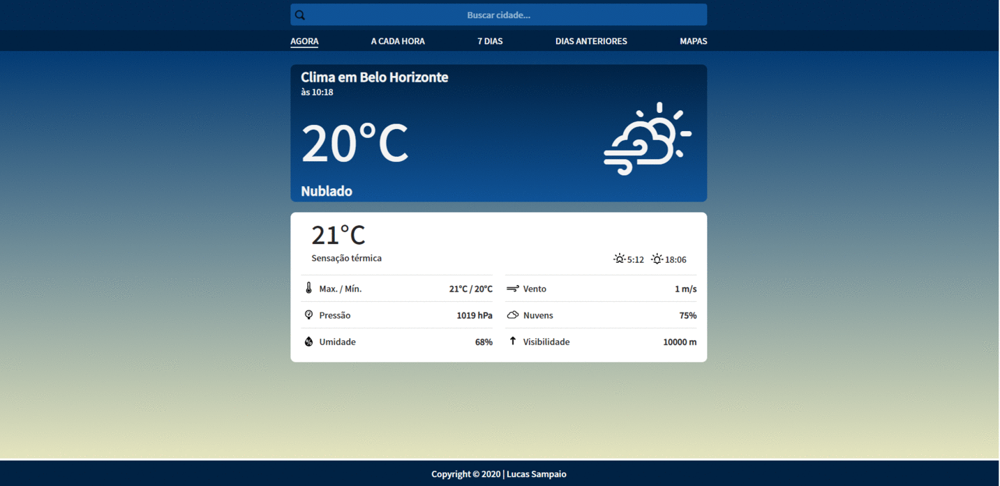

<h1 align="center">
     <a href="https://appweather-above.herokuapp.com/" alt="site do weatherabove"> WeatherAbove App. </a>
</h1>

<h3 align="center">
    ☁️ WeatherAbove é uma aplicação de previsão do tempo que apresenta dados meteorológicos de uma determinada cidade.
</h3>

<p align="center">
  

  

  <a href="https://www.twitter.com/lucasfe4nor/">
    
  </a>
  
  <a href="https://github.com/lucasfe4nor/app-weather/commits/main">
    
  </a>
    
   
   <a href="https://github.com/lucasfe4nor/app-weather/stargazers">
    
  </a>

</p>

<h4 align="center">
	🚧 Concluído 🚧
</h4>

# Tabela de conteúdos

<!--ts-->

- [Sobre o projeto](#-sobre-o-projeto)
- [Funcionalidades](#-funcionalidades)
- [Demonstração da aplicação](#-demonstração-da-aplicação)
- [Como executar o projeto](#-como-executar-o-projeto)
  - [Pré-requisitos](#pré-requisitos)
  - [Rodando a aplicação web](#user-content--rodando-a-aplicação-web-frontend)
- [Tecnologias](#-tecnologias)
  - [WebSite](#user-content-website--react)
- [Autor](#-autor)
- [Licença](#user-content--licença)

<!--te-->

## 💻 Sobre o projeto

Previsão do tempo para todas as cidades (população > 1000hab) do mundo.
Informações sobre condições climáticas como : temperatura, clima, chuva, umidade, vento, etc.

---

## ⚙️ Funcionalidades

As seguintes funcionalidades estão disponíveis:

- [x] Os usuários podem consultar a previsão do tempo:

  - [x] do atual momento
  - [x] das próximas horas
  - [x] dos próximos 7 dias

- [x] Os usuários possuem acesso aos mapas, onde podem consultar os índices de:
  - [x] nuvens
  - [x] chuva
  - [x] velocidade do vento

---

## 🔍 Demonstração da aplicação

A aplicação está hospedada no [Heroku](https://appweather-above.herokuapp.com)

### Web

<p align="center" style="display: flex; align-items: flex-start; justify-content: center;">
  
</p>

---

## 🚀 Como executar o projeto

### Pré-requisitos

Antes de começar, você vai precisar ter instalado em sua máquina as seguintes ferramentas:
[Git](https://git-scm.com), [Node.js](https://nodejs.org/en/) e [Yarn](https://yarnpkg.com/).

#### 🧭 Rodando a aplicação web (Frontend)

```bash

# Clone este repositório
$ git clone https://github.com/lucasfe4nor/app-weather.git

# Acesse a pasta do projeto no seu terminal/cmd
$ cd app-weather

# Instale as dependências
$ yarn install

# Execute a aplicação
$ yarn start

# A aplicação será aberta na porta:3000 - acesse http://localhost:3000

```

---

## 🛠 Tecnologias

As seguintes ferramentas foram usadas na construção do projeto:

#### **Website** ([React](https://reactjs.org/))

- **[React Router Dom](https://github.com/ReactTraining/react-router/tree/master/packages/react-router-dom)**
- **[Leaflet](https://react-leaflet.js.org/en/)**
- **[React Loader Spinner](https://github.com/mhnpd/react-loader-spinner)**

> Veja o arquivo [package.json](https://github.com/lucasfe4nor/app-weather/blob/main/package.json)

---

## 👨‍💻 Autor

- **Lucas Sampaio (lucasfe4nor)** - [Twitter](https://twitter.com/lucasfe4nor) - [LinkedIn](https://www.linkedin.com/in/lucasgbsampaio/)

---

## 📝 Licença

Este projeto está sob a licença [MIT](./LICENSE).

---
